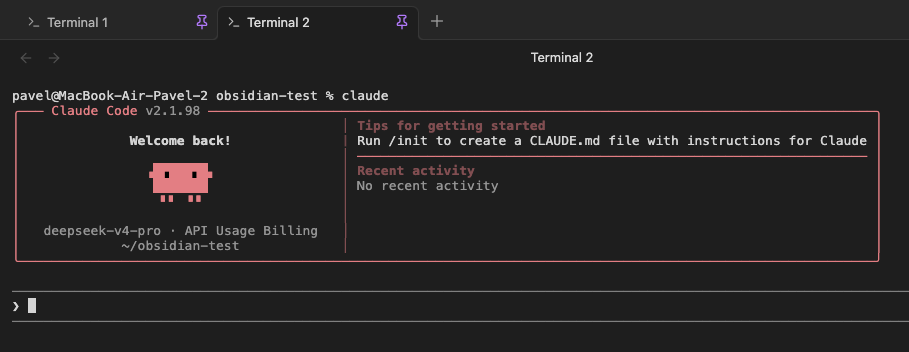
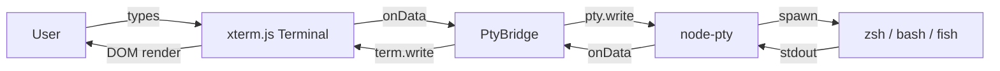

# Obsidian Terminal

Embedded terminal for [Obsidian](https://obsidian.md) — like IntelliJ IDEA's terminal, right inside your vault.



## Features

- **Configurable shell** — zsh (default), bash, fish, or custom path via Settings Tab
- **Auto-detection** — finds available shells on your system, prefers modern ones
- **Multi-terminal** — up to 10 independent terminal tabs
- **Clipboard** — `Ctrl+Shift+C` copy, `Ctrl+Shift+V` paste, right-click context menu
- **Resize-aware** — terminal fits the pane, columns/rows synced to PTY
- **Auto-focus** — terminal grabs focus on open
- **Dark theme** — matches Obsidian's default look

## Quickstart

### 1. Install the plugin

```bash
# Clone into your vault's plugins directory
cd <vault>/.obsidian/plugins/
git clone https://github.com/unltd/obsidian-terminal.git
cd obsidian-terminal

# Install dependencies (including native node-pty binary)
npm install

# Build
npm run build
```

Or use the included install script:

```bash
./install.sh [vault-path]
```

### 2. Enable in Obsidian

Settings → Community Plugins → **Terminal** → Enable

### 3. Open a terminal

- Click the **terminal icon** in the ribbon (left sidebar)
- Or use the Command Palette: `Cmd+P` → "Open terminal"

### 4. Configure your shell (optional)

Settings → Community Plugins → **Terminal** → Options (⚙️) → choose from detected shells or enter a custom path.

## Platform Support

| Platform | Status | Notes |
|----------|--------|-------|
| macOS (x64) | ✅ Tested | `@lydell/node-pty-darwin-x64` |
| macOS (arm64) | ✅ Tested | `@lydell/node-pty-darwin-arm64` |
| Linux (x64) | ✅ Tested (via Docker/claudocker) | `@lydell/node-pty-linux-x64` |
| Windows | ⚠️ Untested | Requires ConPTY (Win 10 1809+). Volunteers welcome! |
| Mobile (iOS/Android) | ❌ Unsupported | Requires Node.js native addon |

The plugin is **desktop only** (`isDesktopOnly: true`). It uses [node-pty](https://github.com/lydell/node-pty) for pseudo-terminal support, which requires a native Node.js addon matching Obsidian's Electron ABI.

## Limitations

- **Limited settings** — shell selection exists, but font size, theme, and scrollback are still hardcoded
- **No theme sync** — terminal colors don't follow Obsidian's theme changes
- **No hotkey customization** — `Ctrl+Shift+C`/`Ctrl+Shift+V` for clipboard are hardcoded
- **No session persistence** — terminals are lost on Obsidian restart (tmux/screen integration planned)
- **No tab completion** — Tab key is intercepted by Obsidian; autocomplete not yet implemented
- **No sidebar mode** — terminal only opens as a bottom pane for now

## Known Issues

### Focus wrestling

Obsidian may steal focus from the terminal after opening or when switching tabs. The plugin fights back with a retry loop, but occasional manual clicks may be needed.

### Cmd+R / Hot Reload

CSS changes may not take effect after a hot reload. **Workaround:** disable and re-enable the plugin in Settings.

## Architecture



**Files:**

| File | Role |
|------|------|
| `src/main.ts` | Plugin entry: register view, ribbon, commands, settings |
| `src/TerminalView.ts` | `ItemView` subclass: xterm.js Terminal + FitAddon |
| `src/PtyBridge.ts` | node-pty wrapper: spawn configured shell, pipe data |
| `src/settings.ts` | Shell detection, resolution, shell-specific flags |
| `src/SettingsTab.ts` | Settings UI: dropdown + custom path with validation |
| `styles.css` | Terminal styling + xterm.js CSS protection rules |

**Tech stack:** TypeScript, esbuild, xterm.js v5, node-pty v1, vanilla DOM.

**Key constraint:** Obsidian applies global CSS to all DOM elements, which breaks xterm.js's internal coordinate grid. The plugin protects critical xterm.js elements with `position`, `overflow`, and `user-select` overrides.

## Development

```bash
npm run dev      # Watch mode (~30ms rebuilds)
npm run build    # Type-check + production bundle
```

See [`CLAUDE.md`](CLAUDE.md) for detailed development notes, CDP testing workflow, and container setup.

### Testing

Tests use Gauge BDD framework + pytest for CDP-based browser automation:

```bash
gauge run tests/specs/   # Run all specs
```

## Roadmap

- [x] Settings tab: shell selection
- [ ] Settings tab: font size, theme, scrollback
- [ ] Canvas/WebGL renderer support (performance)
- [ ] Sidebar mode (left/right panel)
- [ ] Session persistence via tmux/screen
- [ ] Windows support (ConPTY)
- [ ] Tab completion (navigate Obsidian hotkey conflicts)
- [ ] Tab title: current directory or running command

## License

MIT — see [LICENSE](LICENSE) file.
